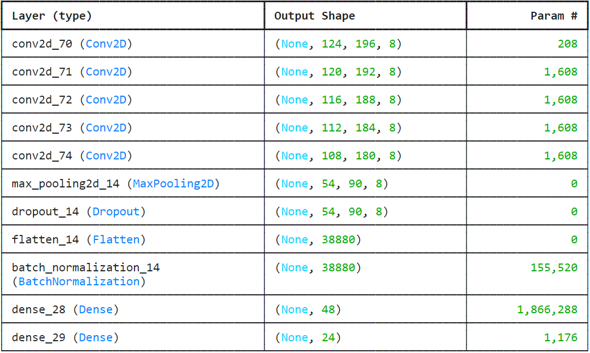
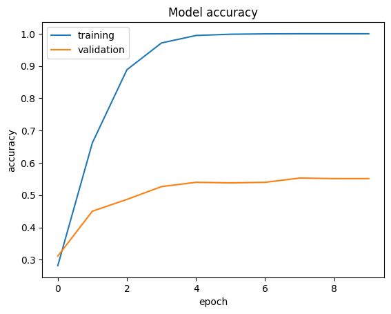
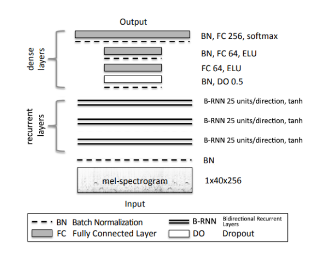
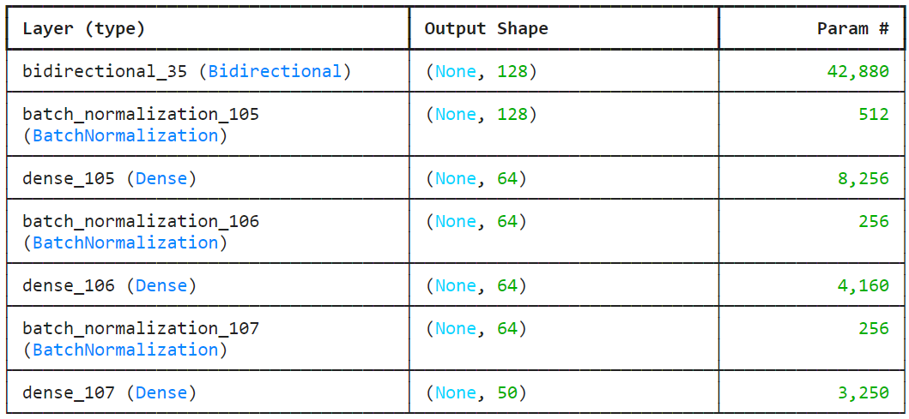
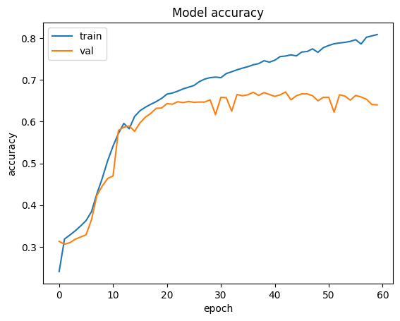

<h1 style="font-size:36px;text-align:center">ECS7013P: <i>Deep Learning in Audio & Music</i>   Musical key & tempo recognition   (Coursework Report)</h1>

- **Student name**: Pranav Narendra Gopalkrishna
- **Student number**: 231052045
- **Date**: 11/04/2023

# Introduction
The tasks chosen for deep learning inference:

1. Musical key recognition
2. Musical tempo recognition

Both are to be treated as classification problems (for reasons explained in the respective sections).

**NOTE**: In each task, the data is divided only into training and validation sets; test sets are not used due to (1) the already limited dataset size and (2) since testing is already done later using external pieces.

# TASK 1: Musical key recognition
Musical keys are inherently categorical, since each key represents not a quantity but a whole class of frequencies. The goal is to predict one of 24 possible keys (major/minor, ignoring enharmonics).

## Data
- Dataset name: GiantSteps Key Set
- GitHub URL: https://github.com/GiantSteps/giantsteps-key-dataset

The above dataset contains:

- CSV file containing annotations for each track
- Audio files corresponding to each annotated track

The CSV file and audio files were extracted by cloning the GitHub repository. Most of the audio files are about two minutes long, though some may be shorter.

## Target classes
However, to enable 1-hot encoding, each musical key has been mapped to an integer. _Note that we ignore enharmonics; for example, A# and Bb are the same key in essence, so we only use Bb._ The key-to-integer mapping is give below:

Class | Integer
---|---
Ab major | 0
Ab minor | 12
A major | 1
A minor | 13
Bb major | 2
Bb minor | 14
B major | 3
B minor | 15
C major | 4
C minor | 16
Db major | 5
Db minor | 17
D major | 6
D minor | 18
Eb major | 7
Eb minor | 19
E major | 8
E minor | 20
F major | 9
F minor | 21
Gb major | 10
Gb minor | 22
G major | 11
G minor | 23

The above mapping is done such that:

- Key $<$ 12 means major
- Key $\geq$ 12 means minor
- If key $<$ 12, key + 12 is the minor version of the same key
- If key $\geq$ 12, key - 12 is the major version of the same key

This becomes useful when trying to measure the proximity of two keys to measure prediction performance, since basic relationships between keys such as perfect fifth and relative minor/major are now easily reducible to mathematical conditions.

## Sample rows of the dataset

After adding target column and removing extraneous columns:

<table border="1" class="dataframe">
  <thead>
    <tr style="text-align: right;">
      <th></th>
      <th>TRACK</th>
      <th>GLOBAL KEY</th>
      <th>TARGET</th>
    </tr>
  </thead>
  <tbody>
    <tr>
      <th>0</th>
      <td>10089</td>
      <td>D major</td>
      <td>6</td>
    </tr>
    <tr>
      <th>1</th>
      <td>61415</td>
      <td>F minor</td>
      <td>21</td>
    </tr>
    <tr>
      <th>2</th>
      <td>74982</td>
      <td>C minor</td>
      <td>16</td>
    </tr>
    <tr>
      <th>3</th>
      <td>101069</td>
      <td>E minor</td>
      <td>20</td>
    </tr>
    <tr>
      <th>4</th>
      <td>190477</td>
      <td>D minor</td>
      <td>18</td>
    </tr>
  </tbody>
</table>

## Machine learning algorithm
A classification such as musical key recognition is done by picking out useful indicators (e.g. baseline pitch, common note intervals, common chords, harmonic patterns, etc.). But such features are non-trivial to define, especially computationally. Hence, using a convolutional neural network becomes the natural solution.

### Input data
Inputs for the CNN were equally-sized log-scaled-amplitude melspectrograms with 128 mel bands; after some trial-and-error, 128 was found to be better than any lower number of mel bands, and significantly higher values led to excessively slower computation. Each audio file's melspectrogram was divided into equally-sized segments and smaller segments were padded with empty columns. Such division into segments also greatly augmented the available data pool, facilitating higher-quality (i.e. more generalisable) training. However, a balance had to be found between the number and size of segments; excessively small segments hindered learning, since key recognition requires a sufficiently large melodic and harmonic context (even for humans).

### Architecture
The architecture referenced (Korzeniowski & Widmer, 2017) is as follows:

The above was modified by adding:

- Different input dimensions according to the melspectrograms
- Max pooling after the last convolutional layer to reduce dimensionality while preserving extracted features
- Dropout layer to avoid overfitting
- Batch normalisation to help smooth gradient descent

The architecture finally used is as follows:

- Total params: 2,029,624
- Trainable params: 1,951,864
- Non-trainable params: 77,760

Following the referenced CNN architecture, the model has the following hyper-parameters:

- Optimizer: Stochastic gradient descent
    - Learning rate = 0.001
    - Momentum = 0.9
    - Weight decay = 0.0001
- Loss function: Categorical Crossentropy

**_The training was done for ten epochs._**

## Performance evaluation
**NOTE**: The following method was only used after training, not during.

### Defining customised performance function
The performance evaluation function is made to account for distance from correct label, since in key estimation, distance is a relevant factor. For example, guessing C major as A minor (its relative minor) is less erroneous than guessing it as E.

_Check appendix for more details._

## Results
Final validation accuracy achieved after ten epochs was 0.5583 ~ 56% (with validation loss 1.9047). The final validation performance as per the above performance evaluation method was 0.6114238410596027 ~ 61%. Training for more epochs did not improve validation accuracy or performance. Moreover, even in ten epochs, the model overfit greatly, reaching 100% accuracy in training (with training loss 0.0176) while validation was stuck at around 50-60%, as seen in the following:

# TASK 2: Musical tempo evaluation
Tempo is a quantity in the ratio scale, but it is easier to train for classification problems using more complex architectures such as CNNs and RNNs, i.e. recurrent neural networks (_we shall see soon how tempo classes are defined_).

## Data
- Dataset name: GiantSteps Tempo Set
- GitHub URL: https://github.com/GiantSteps/giantsteps-tempo-dataset

The above dataset contains:

- Folder containing annotations in text files for each track
- Audio files corresponding to each annotated track

The annotation folder and audio files were extracted by cloning the GitHub repository.

## Target classes
To solve tempo recognition as a classification problem, we consider integer values of tempo classes from [0, 5) to [250, 255) (256 being the maximum tempo value that can be considered here). Hence, the target classes were obtained by integer division of the tempo value (in BPM, i.e. beats per minute) by 5. Hence, the following dataframe is obtained:

<table border="1" class="dataframe">
  <thead>
    <tr style="text-align: right;">
      <th></th>
      <th>TRACK</th>
      <th>TEMPO</th>
      <th>TARGET</th>
    </tr>
  </thead>
  <tbody>
    <tr>
      <th>0</th>
      <td>1030011</td>
      <td>127.0</td>
      <td>25</td>
    </tr>
    <tr>
      <th>1</th>
      <td>1068430</td>
      <td>174.0</td>
      <td>34</td>
    </tr>
    <tr>
      <th>2</th>
      <td>1084996</td>
      <td>142.0</td>
      <td>28</td>
    </tr>
    <tr>
      <th>3</th>
      <td>1092771</td>
      <td>136.0</td>
      <td>27</td>
    </tr>
    <tr>
      <th>4</th>
      <td>1114156</td>
      <td>86.0</td>
      <td>17</td>
    </tr>
  </tbody>
</table>

## Machine learning algorithm
Given that tempo recognition based on both past and future observations (e.g. beats, note velocity, rhythmic cycles, etc.), a bidirectional RNN (B-RNN). Here, each melspectrogram

### Input data
Inputs for the B-RNN were equally-sized log-scaled-amplitude melspectrograms with 12 mel bands; after some trial-and-error, a smaller number of mel bands was found to be more effective and efficient, since tempo recognition does not require a high resolution of notes, melodies and harmonies. Each audio file's melspectrogram was divided into equally-sized segments and smaller segments were padded with empty columns. Such division into segments also greatly augmented the available data pool, facilitating higher-quality (i.e. more generalisable) training. Note that the segments for tempo recognition were even more numerous (hence smaller) than for key recognition, since tempo recognition requires a smaller musical context.

### Architecture
The architecture took inspiration from the one referenced in Soares et. al, 2019. It is as follows:

The above was modified by adding:

- Different input dimensions according to the melspectrograms
- Reducing the number of bidirectional layers to one
- Reducing the number of recurrent layers to three (as one stacked RNN)

The architecture finally used is as follows:

- Total params:  59,570
- Trainable params: 59,058
- Non-trainable params: 512

**NOTE**: The three recurrent layers used are stacked as a single cell containedd in the bidirectional layer.

Following the referenced CNN architecture, the model has the following hyper-parameters:

- Optimizer: Stochastic gradient descent
    - Learning rate = 0.01
    - Momentum = 0
    - Weight decay = 0
- Loss function: Categorical Crossentropy

**_The training was done for sixty epochs._**

## Results
Final validation accuracy achieved after 60 epochs was 0.6401  ~ 64% (with validation loss 1.2823). The model overfit to some extent, reaching upto a training accuracy of 0.8030 ~ 80% (with training loss 0.6015) while validation was stuck at around 60-65%, as seen in the following:

# Combining the two inferences
Due to time constraints, only one method of combining the two inferences was explored, namely post-processing of the predictions of the two models (after training each one and saving the trained weights). To achieve this, each model's weights after training were stored, then assigned to models (of matching architectures) within a class `KeyAndTempoClassifier`, which has methods for:

- Loading the relevant audio files and obtainin raw waveforms
- Coverting the raw waveforms to spectrograms
- Coverting the spectrograms to melspectrograms of a fixed size
- Obtaining predictions on the melspectrograms

The predicted class is by default in 1-hot encoding, so to convert it into the respective integer form, an _argmax_ is taken; the maximum-valued index in the 1-hot vector corresponds to the target integer value. This integer value can be mapped back to an actual key or tempo value. For keys, a dictionary is used that maps each integer to the respective key name. For tempi, the integer value is multiplied by 5 (since it was obtained by integer division with 5).

To test the combined inference model, the audio files of both the tasks were merged. Since both tasks use datasets such that the key dataset has no annotations for tempo and the tempo dataset has no annotations for key, accuracy of each prediction could only be measured against audio files coming from the respective task's folder. That said, the accuracy measured for selected random samples was relatively high for both predictive tasks. Upon a few random selections of new predictions and personal verificiation of prediction (e.g. verifying the predicted key of a file from the tempo dataset), the predictions proved to be remarkably accurate.

# Application to case study
My case study audio file is my own composition "Ambient Life". It is over five minutes long, and involves multiple voices and various key shifts throughout its duration, displaying considerable complexity. The combined inference model (which is essentially two separate models run in parallel) was applied to 40 segments (8 second long each) of the piece. Some segment-wise predictions are:

<table border="1" class="dataframe">
  <thead>
    <tr style="text-align: right;">
      <th></th>
      <th>Segment</th>
      <th>Key predictions</th>
      <th>Tempo predictions</th>
    </tr>
  </thead>
  <tbody>
    <tr>
      <th>0</th>
      <td>1</td>
      <td>C minor</td>
      <td>125</td>
    </tr>
    <tr>
      <th>1</th>
      <td>2</td>
      <td>C minor</td>
      <td>0</td>
    </tr>
    <tr>
      <th>2</th>
      <td>3</td>
      <td>F major</td>
      <td>110</td>
    </tr>
    <tr>
      <th>3</th>
      <td>4</td>
      <td>F major</td>
      <td>0</td>
    </tr>
    <tr>
      <th>4</th>
      <td>5</td>
      <td>C minor</td>
      <td>0</td>
    </tr>
    <tr>
      <th>5</th>
      <td>6</td>
      <td>C minor</td>
      <td>0</td>
    </tr>
  </tbody>
</table>

Each prediction can be personally verified using a small player given in the code. A common error noticed was the misidentification of a key with its relative minor or even the relative minor of its fifth. Such errors indicate that the model is heading in the right direction, since the "wrong" keys are quite close the "right" keys. Nevertheless, it is clear the model's training could be improved, chiefly by improving the dataset but also by enabling the model to pick out more relevant features.

As for tempo prediction, most segments are marked as 125 (the original tempo marking was 120); this is again quite close to the ground truth, but we see also that the quieter sections of the piece are marked with a slower or even zero tempo. This is to be expected, especially for such short segments, since the model has little-to-no context to recognise the tempo. However, where the context does exist, the model is remarkably accurate.

# Conclusion
This report discussed the solutions of musical key recognition and tempo recognition using machine learning methods, namely a convolutional neural network (CNN) and a bidirectional recurrent neural network (B-RNN); each is chosen to fit the respective domain. Furthermore, the relevance of preprocessing the data is clear; the domain determines the data complexity and the kind of complexity included.

# Citations

- **In-text**: (Korzeniowski & Widmer, 2017)
    - Korzeniowski, F. and Widmer, G. (2017). 'End-to-End Musical Key Estimation Using a Convolutional Neural Network'. _First published in the Proceedings of the 25th European Signal Processing Conference (EUSIPCO-2017)_.
- **In-text**: (Soares et. al, 2019)
    - Soares de Oliveira de Souza, M., Nuno de Souza Moura, P. and Briot, J. (2019). 'Music Tempo Estimation via Neural Networks - A Comparative Analysis'.

# Appendix
## Custom performance metric
### Categories of musical key predictions
- **Correct**: if the tonic and the mode (major/minor) of prediction and target correspond
- **Fifth**: if the tonic of the prediction is the fifth of the target (or vice versa), and modes correspond
- **Relative Minor/Major**: if modes differ and either one of the following is true:
    - The predicted mode is minor and the predicted tonic is 3 semitones below the target
    - The predicted mode is major and the predicted tonic is 3 semitones above the target
- **Parallel Minor/Major**: if modes differ but the predicted tonic matches the target
- **Other**: Prediction errors not caught by any category, i.e. the most severe errors

The custom performance metric takes the above categories into consideration.

(Korzeniowski & Widmer, 2017)

### Performance evaluation
We first compute the ratio of predictions that fall into each category. We then calculate the MIREX weighted score as:

$w = r_c + 0.5 \cdot r_f + 0.3 \cdot r_r + 0.2 \cdot r_p$

Here, $r_c$, $r_f$ , $r_r$ and $r_p$ are the ratios of the correct, fifth, relative minor/major and parallel minor/major respectively.

(Korzeniowski & Widmer, 2017)